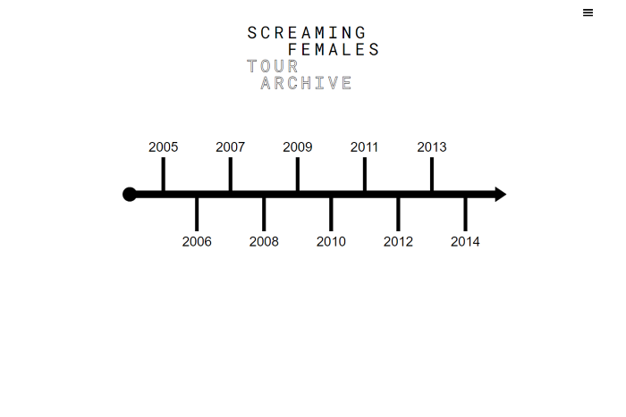
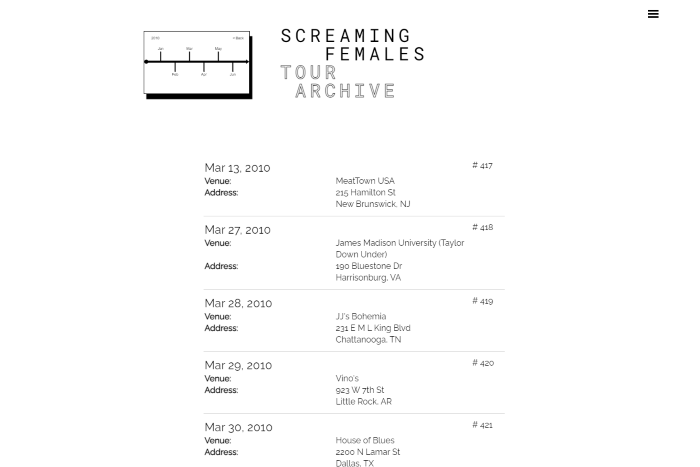
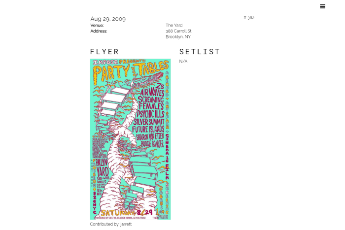

# Screaming Females Tour Archive
<https://screamingfemalestourarchive.com/>\
Version 1.0 \
Version Deployment Date - March 01, 2021\
By Jarrett Dougherty

<kbd></kbd>

<kbd></kbd>

<kbd></kbd>

## Description
Screaming Females Tour Archive is an interactive archive of performance information for the legendary DIY band Screaming Females. The application allows users to browse and search the archives in numerous ways and allows users to add information to the archive (poster images; links to video, reviews, and audio; denote attendance). The application uses Node.js, Express.js, React.js, and MongoDB. It is deployed to an Ubuntu DigitalOcean server. The site uses very few outside packages, being built primarily with HTML, CSS, and JavaScript (in JSX). The archive has a robust API with various permissions including an admin. An interactive SVG timeline module was built using vanilla JavaScript and XML. The site offers a full user experience including password protection and password reset.

## Technologies Used
* HTML
* CSS
* JavaScript
* Node.js
* Express.js
* React.js
* MongoDB
* Mongoose
* Express Session
* Axios
* SVG
* XML
* Multer
* Nodemailer